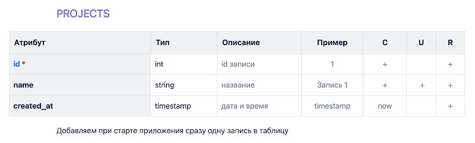
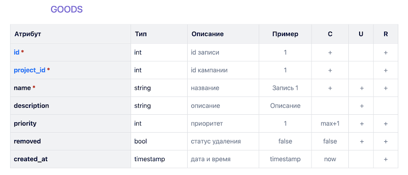
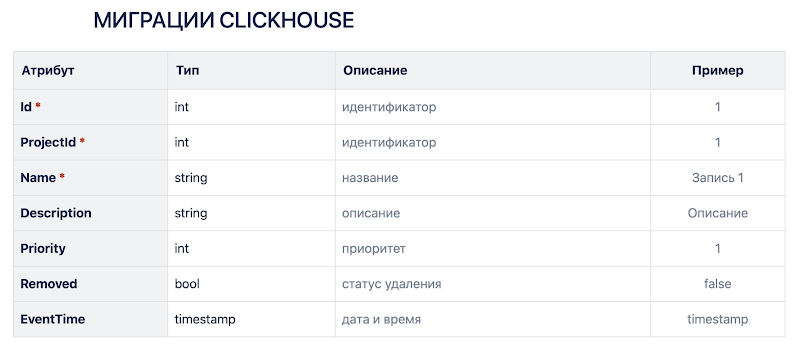
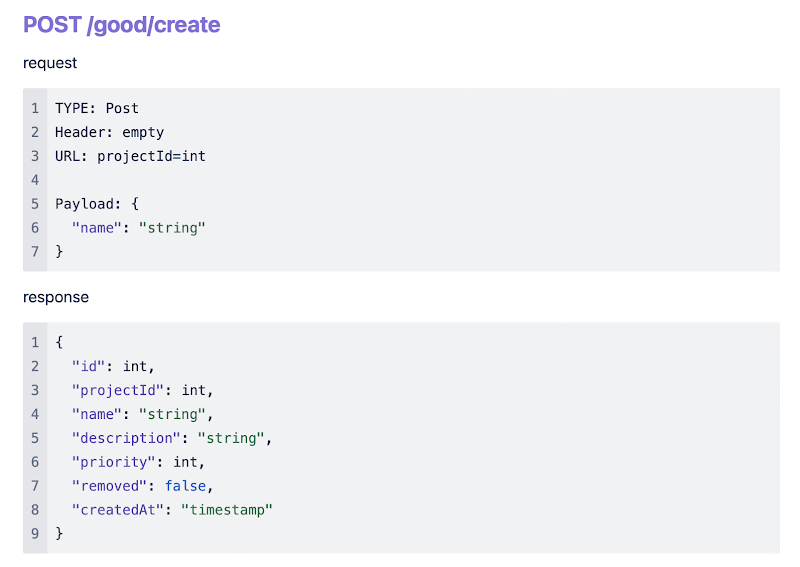
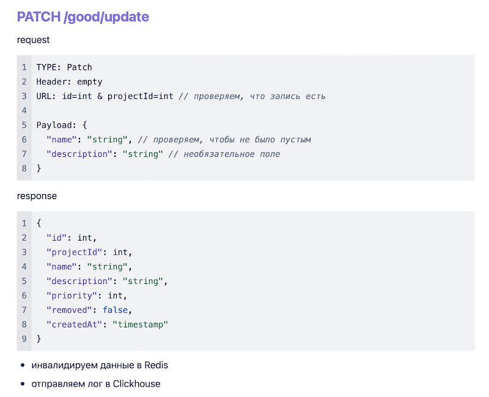
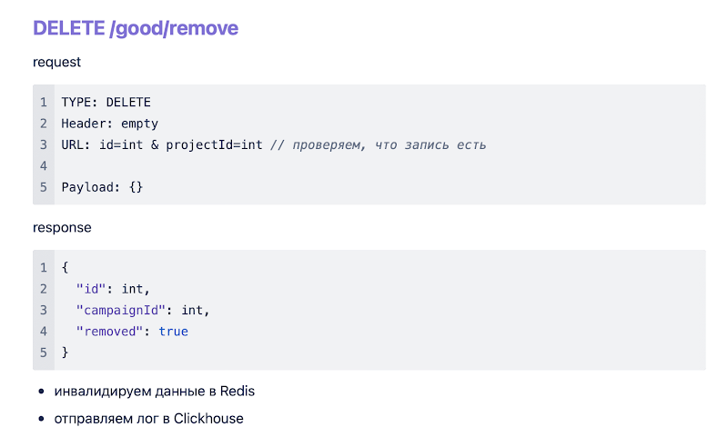
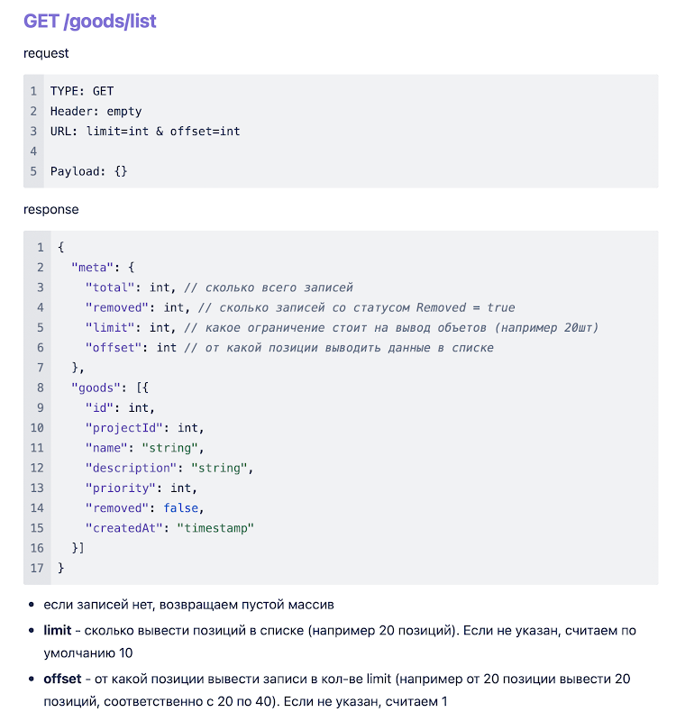
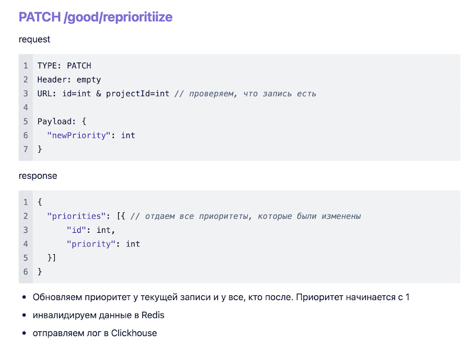

Описание
Этот проект представляет собой сервис, разработанный на Go, который использует Postgres для хранения данных, Clickhouse для аналитики, Nats (в качестве альтернативы Kafka) для обмена сообщениями и Redis для кеширования. Сервис включает в себя CRUD операции для работы с данными в таблице GOODS в Postgres, а также логирование изменений данных в Clickhouse через очередь Nats.

Технологии
Golang: Язык программирования для разработки сервиса.
Postgres: Система управления базами данных для хранения данных.
Clickhouse: Система управления базами данных для аналитики и логирования.
Nats: Система обмена сообщениями для асинхронной обработки задач.
Redis: Система кеширования для ускорения доступа к данным.
Docker: Контейнеризация приложения для упрощения развертывания.
Миграции
Миграции Postgres включают в себя создание таблицы GOODS с определенными полями, установку primary-key и индексов на указанные поля. При добавлении записи в таблицу устанавливается приоритет как максимальный приоритет в таблице +1, причем приоритеты начинаются с 1. При накатке миграций добавляется одна запись в таблицу Projects по умолчанию.

CRUD операции
Реализованы CRUD методы на GET, POST, PATCH, DELETE данных в таблице GOODS в Postgres. При редактировании данных в Postgres ставится блокировка на чтение записи и оборачивается все в транзакцию. Валидируются поля при редактировании. При редактировании данных в GOODS инвалидируются данные в Redis. Если записи нет (проверяется на PATCH-DELETE), выдается ошибка (статус 404).

Кеширование в Redis
При GET запросе данных из Postgres кешируются данные в Redis на минуту. Пытаемся получить данные сперва из Redis, если их нет, идем в БД и кладем их в Redis.

Логирование в Clickhouse
При добавлении, редактировании или удалении записи в Postgres данные записываются в лог в Clickhouse через очередь Nats. Логи записываются пачками в Clickhouse.

Обертывание приложения в Docker
Приложение обернуто в Docker для упрощения развертывания.

Запуск
Убедитесь, что у вас установлены Docker и Docker Compose.
Запустите docker-compose up -d в корневой директории проекта.
Приложение будет доступно по адресу http://localhost:3335.
Дополнительная информация
Для более подробной информации обратитесь к документации каждой из используемых технологий.

### REST Методы

Меняем позицию у текущей сущности и у сущностей после этой (прибавляем +1)

[ссылка на задание](https://docs.google.com/document/u/0/d/1xFDOElOzOYPfkof0dAM8nBk-XKSam_husx7f3a3sAWU/mobilebasic)
